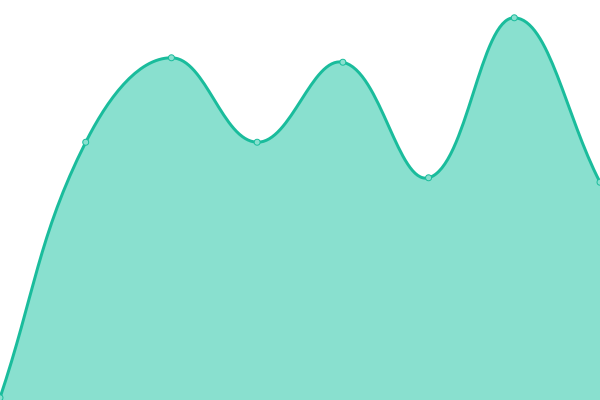
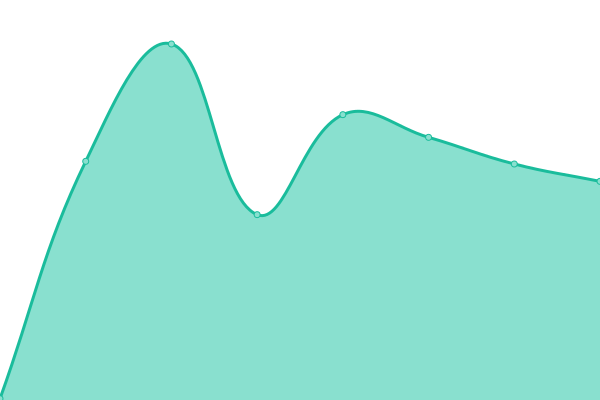
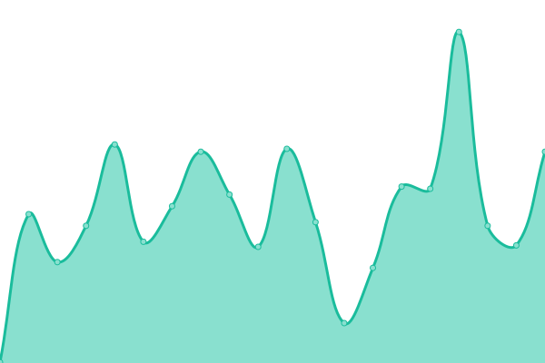
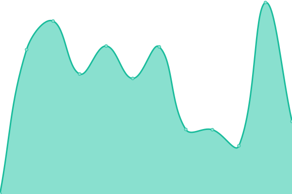

# [📈 Live Status](https://demo.upptime.js.org): <!--live status--> **🟩 All systems operational**

This repository contains the open-source uptime monitor and status page for [Upptime](https://upptime.js.org), powered by [Upptime](https://github.com/upptime/upptime).

With [Upptime](https://upptime.js.org), you can get your own unlimited and free uptime monitor and status page, powered entirely by a GitHub repository. We use [Issues](https://github.com/upptime/upptime/issues) as incident reports, [Actions](https://github.com/Voice-Mate/status-page/actions) as uptime monitors, and [Pages](https://demo.upptime.js.org) for the status page.

<!--start: status pages-->
<!-- This summary is generated by Upptime (https://github.com/upptime/upptime) -->
<!-- Do not edit this manually, your changes will be overwritten -->
<!-- prettier-ignore -->
| URL | Status | History | Response Time | Uptime |
| --- | ------ | ------- | ------------- | ------ |
|  [Website and Mobile App (API)](https://voicemate.nl/fastapistatus) | 🟩 Up | [website-and-mobile-app-api.yml](https://github.com/Voice-Mate/status-page/commits/HEAD/history/website-and-mobile-app-api.yml) | 

 577ms
     
 | 

<a href="https://status.voicemate.nl/history/website-and-mobile-app-api">100.00%</a>
    

|  [Networking and load balancer (nginx)](https://voicemate.nl/healthcheck) | 🟩 Up | [networking-and-load-balancer-nginx.yml](https://github.com/Voice-Mate/status-page/commits/HEAD/history/networking-and-load-balancer-nginx.yml) | 

 129ms
     
 | 

<a href="https://status.voicemate.nl/history/networking-and-load-balancer-nginx">100.00%</a>
    

|  [Task Processor (Redis)](https://voicemate.nl/redisstatus) | 🟩 Up | [task-processor-redis.yml](https://github.com/Voice-Mate/status-page/commits/HEAD/history/task-processor-redis.yml) | 

 137ms
     
 | 

<a href="https://status.voicemate.nl/history/task-processor-redis">100.00%</a>
    

|  [Database](https://voicemate.nl/databasestatus) | 🟩 Up | [database.yml](https://github.com/Voice-Mate/status-page/commits/HEAD/history/database.yml) | 

 191ms
     
 | 

<a href="https://status.voicemate.nl/history/database">100.00%</a>
    

|  [Billing](https://voicemate.nl/stripestatus) | 🟩 Up | [billing.yml](https://github.com/Voice-Mate/status-page/commits/HEAD/history/billing.yml) | 

 526ms
     
 | 

<a href="https://status.voicemate.nl/history/billing">100.00%</a>
    

|  [Development/Test environment](https://triage-voicemate-backend.sou81r6ngg1is.eu-central-1.cs.amazonlightsail.com/fastapistatus) | 🟩 Up | [development-test-environment.yml](https://github.com/Voice-Mate/status-page/commits/HEAD/history/development-test-environment.yml) | 

 649ms
     
 | 

<a href="https://status.voicemate.nl/history/development-test-environment">100.00%</a>
    

|  [Call routing](https://voicemate.nl/twiliostatus) | 🟩 Up | [call-routing.yml](https://github.com/Voice-Mate/status-page/commits/HEAD/history/call-routing.yml) | 

 284ms
     
 | 

<a href="https://status.voicemate.nl/history/call-routing">99.93%</a>
    

|  [AI Call Services (Vapi)](https://status.vapi.ai) | 🟩 Up | [ai-call-services-vapi.yml](https://github.com/Voice-Mate/status-page/commits/HEAD/history/ai-call-services-vapi.yml) | 

 1315ms
     
 | 

<a href="https://status.voicemate.nl/history/ai-call-services-vapi">97.31%</a>
    

|  [Large Language Model (OpenAI)](https://status.openai.com/) | 🟩 Up | [large-language-model-open-ai.yml](https://github.com/Voice-Mate/status-page/commits/HEAD/history/large-language-model-open-ai.yml) | 

 265ms
     
 | 

<a href="https://status.voicemate.nl/history/large-language-model-open-ai">95.16%</a>
    

|  [Usage Analytics (Mixpanel)](https://www.mixpanelstatus.com/) | 🟩 Up | [usage-analytics-mixpanel.yml](https://github.com/Voice-Mate/status-page/commits/HEAD/history/usage-analytics-mixpanel.yml) | 

 327ms
     
 | 

<a href="https://status.voicemate.nl/history/usage-analytics-mixpanel">100.00%</a>
    

<!--end: status pages-->

[**Visit our status website →**](https://demo.upptime.js.org)

## 📄 License

- Powered by: [Upptime](https://github.com/upptime/upptime)
- Code: [MIT](./LICENSE) © [Anand Chowdhary](https://anandchowdhary.com), supported by [Pabio](https://pabio.com)
- Data in the `./history` directory: [Open Database License](https://opendatacommons.org/licenses/odbl/1-0/)
