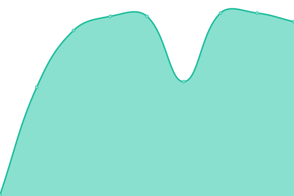
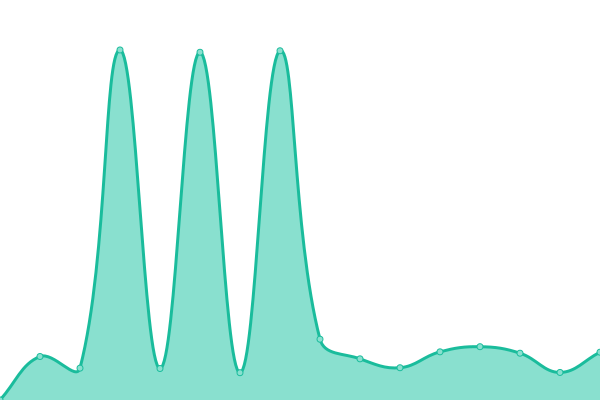

# [📈 Live Status](https://demo.upptime.js.org): <!--live status--> **🟧 Partial outage**

This repository contains the open-source uptime monitor and status page for [Upptime](https://upptime.js.org), powered by [Upptime](https://github.com/upptime/upptime).

With [Upptime](https://upptime.js.org), you can get your own unlimited and free uptime monitor and status page, powered entirely by a GitHub repository. We use [Issues](https://github.com/upptime/upptime/issues) as incident reports, [Actions](https://github.com/Voice-Mate/status-page/actions) as uptime monitors, and [Pages](https://demo.upptime.js.org) for the status page.

<!--start: status pages-->
<!-- This summary is generated by Upptime (https://github.com/upptime/upptime) -->
<!-- Do not edit this manually, your changes will be overwritten -->
<!-- prettier-ignore -->
| URL | Status | History | Response Time | Uptime |
| --- | ------ | ------- | ------------- | ------ |
|  [Website and Mobile App](https://voicemate.nl/fastapistatus) | 🟩 Up | [website-and-mobile-app.yml](https://github.com/Voice-Mate/status-page/commits/HEAD/history/website-and-mobile-app.yml) | 

 554ms
     
 | 

<a href="https://status.voicemate.nl/history/website-and-mobile-app">100.00%</a>
    

|  [Networking and load balancer](https://voicemate.nl/healthcheck) | 🟩 Up | [networking-and-load-balancer.yml](https://github.com/Voice-Mate/status-page/commits/HEAD/history/networking-and-load-balancer.yml) | 

 259ms
     
 | 

<a href="https://status.voicemate.nl/history/networking-and-load-balancer">100.00%</a>
    

|  [Task Processor](https://voicemate.nl/redisstatus) | 🟩 Up | [task-processor.yml](https://github.com/Voice-Mate/status-page/commits/HEAD/history/task-processor.yml) | 

 102ms
     
 | 

<a href="https://status.voicemate.nl/history/task-processor">100.00%</a>
    

|  [Database](https://voicemate.nl/databasestatus) | 🟥 Down | [database.yml](https://github.com/Voice-Mate/status-page/commits/HEAD/history/database.yml) | 

 127ms
     
 | 

<a href="https://status.voicemate.nl/history/database">92.69%</a>
    

|  [AI Call Services](https://status.vapi.ai) | 🟩 Up | [ai-call-services.yml](https://github.com/Voice-Mate/status-page/commits/HEAD/history/ai-call-services.yml) | 

 1050ms
     
 | 

<a href="https://status.voicemate.nl/history/ai-call-services">100.00%</a>
    

<!--end: status pages-->

[**Visit our status website →**](https://demo.upptime.js.org)

## 📄 License

- Powered by: [Upptime](https://github.com/upptime/upptime)
- Code: [MIT](./LICENSE) © [Anand Chowdhary](https://anandchowdhary.com), supported by [Pabio](https://pabio.com)
- Data in the `./history` directory: [Open Database License](https://opendatacommons.org/licenses/odbl/1-0/)
