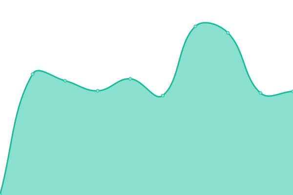
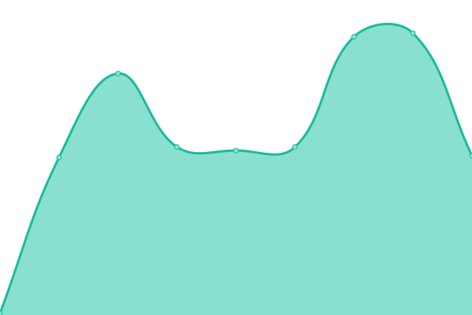
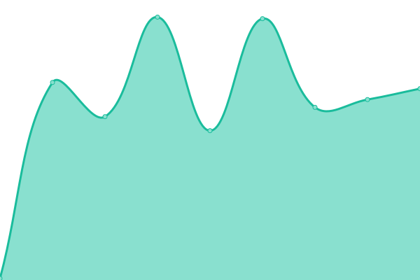
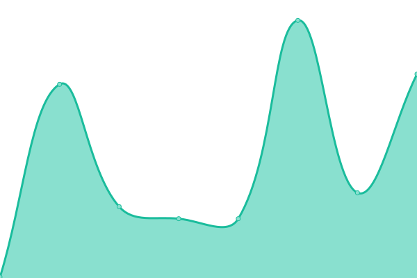

# [📈 Live Status](https://demo.upptime.js.org): <!--live status--> **🟧 Partial outage**

This repository contains the open-source uptime monitor and status page for [Upptime](https://upptime.js.org), powered by [Upptime](https://github.com/upptime/upptime).

With [Upptime](https://upptime.js.org), you can get your own unlimited and free uptime monitor and status page, powered entirely by a GitHub repository. We use [Issues](https://github.com/upptime/upptime/issues) as incident reports, [Actions](https://github.com/Voice-Mate/status-page/actions) as uptime monitors, and [Pages](https://demo.upptime.js.org) for the status page.

<!--start: status pages-->
<!-- This summary is generated by Upptime (https://github.com/upptime/upptime) -->
<!-- Do not edit this manually, your changes will be overwritten -->
<!-- prettier-ignore -->
| URL | Status | History | Response Time | Uptime |
| --- | ------ | ------- | ------------- | ------ |
|  [Voice Mate Homepage](https://voicemate.nl) | 🟩 Up | [voice-mate-homepage.yml](https://github.com/Voice-Mate/status-page/commits/HEAD/history/voice-mate-homepage.yml) | 

 761ms
     
 | 

<a href="https://status.voicemate.nl/history/voice-mate-homepage">100.00%</a>
    

|  [Voicemate Server](https://voicemate.nl/aws/healthcheck/) | 🟩 Up | [voicemate-server.yml](https://github.com/Voice-Mate/status-page/commits/HEAD/history/voicemate-server.yml) | 

 123ms
     
 | 

<a href="https://status.voicemate.nl/history/voicemate-server">100.00%</a>
    

|  [Voicemate reverse proxy](https://voicemate.nl/healthcheck) | 🟩 Up | [voicemate-reverse-proxy.yml](https://github.com/Voice-Mate/status-page/commits/HEAD/history/voicemate-reverse-proxy.yml) | 

 116ms
     
 | 

<a href="https://status.voicemate.nl/history/voicemate-reverse-proxy">100.00%</a>
    

|  [Voicemate Available Phone numbers](https://voicemate.nl/api/switchboard/available-phone-numbers/) | 🟥 Down | [voicemate-available-phone-numbers.yml](https://github.com/Voice-Mate/status-page/commits/HEAD/history/voicemate-available-phone-numbers.yml) | 

 644ms
     
 | 

<a href="https://status.voicemate.nl/history/voicemate-available-phone-numbers">0.00%</a>
    

|  [Triage Mate Homepage](https://triage.voicemate.nl) | 🟩 Up | [triage-mate-homepage.yml](https://github.com/Voice-Mate/status-page/commits/HEAD/history/triage-mate-homepage.yml) | 

 799ms
     
 | 

<a href="https://status.voicemate.nl/history/triage-mate-homepage">100.00%</a>
    

|  [Triage Voicemate Server](https://triage.voicemate.nl/aws/healthcheck/) | 🟩 Up | [triage-voicemate-server.yml](https://github.com/Voice-Mate/status-page/commits/HEAD/history/triage-voicemate-server.yml) | 

 115ms
     
 | 

<a href="https://status.voicemate.nl/history/triage-voicemate-server">100.00%</a>
    

|  [Triage Voicemate reverse proxy](https://triage.voicemate.nl/healthcheck) | 🟩 Up | [triage-voicemate-reverse-proxy.yml](https://github.com/Voice-Mate/status-page/commits/HEAD/history/triage-voicemate-reverse-proxy.yml) | 

 107ms
     
 | 

<a href="https://status.voicemate.nl/history/triage-voicemate-reverse-proxy">100.00%</a>
    

|  [API Documentation](https://voicemate.nl/docs) | 🟩 Up | [api-documentation.yml](https://github.com/Voice-Mate/status-page/commits/HEAD/history/api-documentation.yml) | 

 126ms
     
 | 

<a href="https://status.voicemate.nl/history/api-documentation">100.00%</a>
    

|  [Partner bland.ai](https://www.bland.ai/) | 🟩 Up | [partner-bland-ai.yml](https://github.com/Voice-Mate/status-page/commits/HEAD/history/partner-bland-ai.yml) | 

 267ms
     
 | 

<a href="https://status.voicemate.nl/history/partner-bland-ai">100.00%</a>
    

|  [Partner twilio](https://www.twilio.com/en-us) | 🟩 Up | [partner-twilio.yml](https://github.com/Voice-Mate/status-page/commits/HEAD/history/partner-twilio.yml) | 

 193ms
     
 | 

<a href="https://status.voicemate.nl/history/partner-twilio">100.00%</a>
    

<!--end: status pages-->

[**Visit our status website →**](https://demo.upptime.js.org)

## 📄 License

- Powered by: [Upptime](https://github.com/upptime/upptime)
- Code: [MIT](./LICENSE) © [Anand Chowdhary](https://anandchowdhary.com), supported by [Pabio](https://pabio.com)
- Data in the `./history` directory: [Open Database License](https://opendatacommons.org/licenses/odbl/1-0/)
