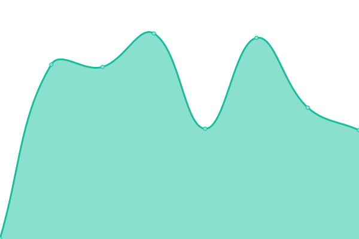

# [📈 Live Status](https://demo.upptime.js.org): <!--live status--> **🟧 Partial outage**

This repository contains the open-source uptime monitor and status page for [Upptime](https://upptime.js.org), powered by [Upptime](https://github.com/upptime/upptime).

With [Upptime](https://upptime.js.org), you can get your own unlimited and free uptime monitor and status page, powered entirely by a GitHub repository. We use [Issues](https://github.com/upptime/upptime/issues) as incident reports, [Actions](https://github.com/Voice-Mate/status-page/actions) as uptime monitors, and [Pages](https://demo.upptime.js.org) for the status page.

<!--start: status pages-->
<!-- This summary is generated by Upptime (https://github.com/upptime/upptime) -->
<!-- Do not edit this manually, your changes will be overwritten -->
<!-- prettier-ignore -->
| URL | Status | History | Response Time | Uptime |
| --- | ------ | ------- | ------------- | ------ |
|  [Voice Mate Application API](https://voicemate.nl/fastapistatus) | 🟥 Down | [voice-mate-application-api.yml](https://github.com/Voice-Mate/status-page/commits/HEAD/history/voice-mate-application-api.yml) | 

 793ms
     
 | 

<a href="https://status.voicemate.nl/history/voice-mate-application-api">99.65%</a>
    

|  [Reverse Proxy (nginx)](https://voicemate.nl/healthcheck) | 🟥 Down | [reverse-proxy-nginx.yml](https://github.com/Voice-Mate/status-page/commits/HEAD/history/reverse-proxy-nginx.yml) | 

 438ms
     
 | 

<a href="https://status.voicemate.nl/history/reverse-proxy-nginx">99.72%</a>
    

|  [Persistent Database Server (DynamoDB)](https://voicemate.nl/databasestatus) | 🟥 Down | [persistent-database-server-dynamo-db.yml](https://github.com/Voice-Mate/status-page/commits/HEAD/history/persistent-database-server-dynamo-db.yml) | 

 470ms
     
 | 

<a href="https://status.voicemate.nl/history/persistent-database-server-dynamo-db">99.80%</a>
    

|  [In-Memory Database Server(Redis)](https://voicemate.nl/redisstatus) | 🟥 Down | [in-memory-database-server-redis.yml](https://github.com/Voice-Mate/status-page/commits/HEAD/history/in-memory-database-server-redis.yml) | 

 478ms
     
 | 

<a href="https://status.voicemate.nl/history/in-memory-database-server-redis">99.87%</a>
    

|  [Background Task Queue/Worker](https://voicemate.nl/failed_tasks) | 🟥 Down | [background-task-queue-worker.yml](https://github.com/Voice-Mate/status-page/commits/HEAD/history/background-task-queue-worker.yml) | 

 456ms
     
 | 

<a href="https://status.voicemate.nl/history/background-task-queue-worker">0.00%</a>
    

|  [Payment Services (Stripe)](https://voicemate.nl/stripestatus) | 🟥 Down | [payment-services-stripe.yml](https://github.com/Voice-Mate/status-page/commits/HEAD/history/payment-services-stripe.yml) | 

 800ms
     
 | 

<a href="https://status.voicemate.nl/history/payment-services-stripe">99.98%</a>
    

|  [Issues and Errors (Sentry)](https://voicemate.nl/sentry_issues) | 🟩 Up | [issues-and-errors-sentry.yml](https://github.com/Voice-Mate/status-page/commits/HEAD/history/issues-and-errors-sentry.yml) | 

 1532ms
     
 | 

<a href="https://status.voicemate.nl/history/issues-and-errors-sentry">100.00%</a>
    

|  [Phone Call Handling (Twilio)](https://voicemate.nl/twiliostatus) | 🟩 Up | [phone-call-handling-twilio.yml](https://github.com/Voice-Mate/status-page/commits/HEAD/history/phone-call-handling-twilio.yml) | 

 607ms
     
 | 

<a href="https://status.voicemate.nl/history/phone-call-handling-twilio">100.00%</a>
    

|  [Reconsilliation between Stripe, Twilio and Database](https://voicemate.nl/databases_in_sync) | 🟩 Up | [reconsilliation-between-stripe-twilio-and-database.yml](https://github.com/Voice-Mate/status-page/commits/HEAD/history/reconsilliation-between-stripe-twilio-and-database.yml) | 

 2307ms
     
 | 

<a href="https://status.voicemate.nl/history/reconsilliation-between-stripe-twilio-and-database">100.00%</a>
    

|  [Development/Test environment](https://triage-voicemate-backend.sou81r6ngg1is.eu-central-1.cs.amazonlightsail.com/fastapistatus) | 🟩 Up | [development-test-environment.yml](https://github.com/Voice-Mate/status-page/commits/HEAD/history/development-test-environment.yml) | 

 813ms
     
 | 

<a href="https://status.voicemate.nl/history/development-test-environment">100.00%</a>
    

|  [AI-Powered Voice Processing Services (Vapi)](https://status.vapi.ai) | 🟩 Up | [ai-powered-voice-processing-services-vapi.yml](https://github.com/Voice-Mate/status-page/commits/HEAD/history/ai-powered-voice-processing-services-vapi.yml) | 

 2354ms
     
 | 

<a href="https://status.voicemate.nl/history/ai-powered-voice-processing-services-vapi">100.00%</a>
    

<!--end: status pages-->

[**Visit our status website →**](https://demo.upptime.js.org)

## 📄 License

- Powered by: [Upptime](https://github.com/upptime/upptime)
- Code: [MIT](./LICENSE) © [Anand Chowdhary](https://anandchowdhary.com), supported by [Pabio](https://pabio.com)
- Data in the `./history` directory: [Open Database License](https://opendatacommons.org/licenses/odbl/1-0/)
